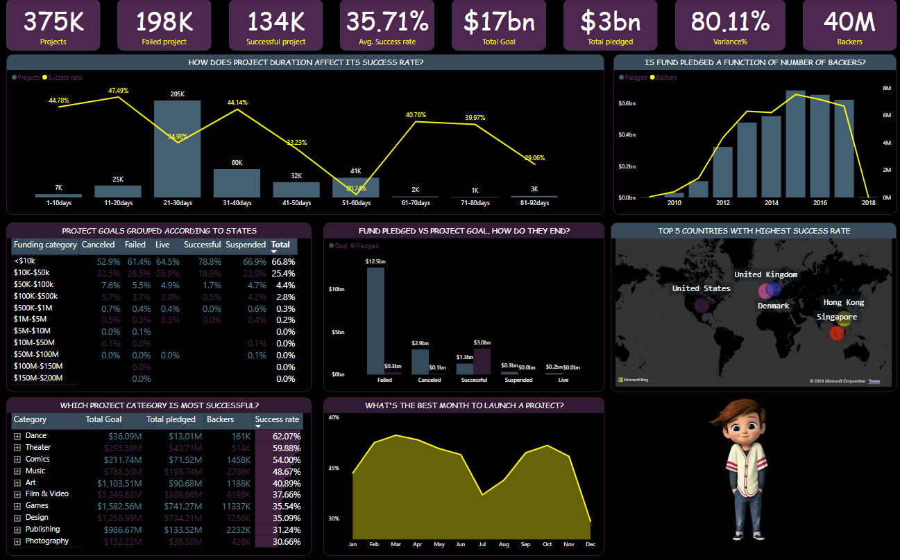
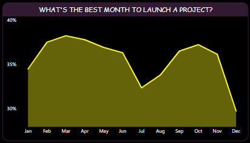
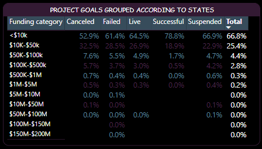
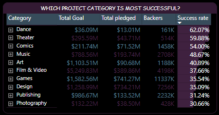
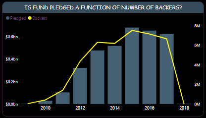
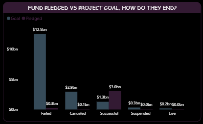
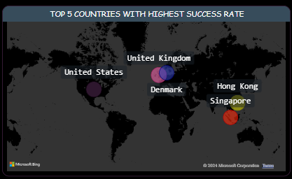

# Business Case
Kickstarter is a crowdfunding platform that enables individuals, entrepreneurs, artists, and creators to raise funds for their projects or products by collecting small contributions from a large number of people, typically in exchange for rewards or equity. Basically, Creators create and launch projects on Kickstarter, Backers pledge money to support projects. If the project reaches its funding goal, Kickstarter processes payments, creators receive funds and fulfill rewards. Project categories includes Art, Comics, Design, Fashion, Film & Video, Games, Music, Photography, Technology and Theater. Kickstarter democratizes access to funding, allows creators to maintain control and ownership, facilitates community engagement and validation and provides market feedback and testing.

This project seeks to deep dive into the most successful projects and seeks to answer the question of why they are successful.

The process flow in arriving at the insights includes:
- Importing the csv datasets into Power BI.
- Exploring the different variables, datatypes and relationships contained in the dataset.
- Building relationship between the different tables and writing DAX to generate extra information about the data.
- Summarizing these information into visualizations and reports of findings with recommendations.
---

## Dashboard

---

# Analysis
Projects are only successful when amount pledged equals or exceeds project goal, hence amount pledged increases with number of backers. 53.4%(205k) of total projects had a project duration of 21-30days with success rate of 34.98%, slightly below the all-time average of 35.71%.  Meanwhile, projects with 11-20days have highest success rate at 47.49% with only about 25k projects. 

### When is the best time to launch a project?
The analysis shows that from January, success rate of projects begins an uptrend that peaks in march, then declines till July where it begins to trend higher again halting in October. ***leaving March (38.23%), April (37.79%), February (37.5%) and October (37.23%) the most preferred months to launch a project respectively.***

### How does a project goal affect its success rate?

Projects with goal ranging from $5m-$200m where unsuccessful with 100% failure recorded for $100m-$200m. however projects less than $10k, $10k-$50k, and $50k-$100k had success rates of 42.13%, 26.75% and 13.84% respectively. 

### Most successful project categories
Dance, Theatre, and Comics are top three most successful categories and had over 87% of its successful projects under $10k goal, while at least 70% of its total projects had less than $10k goal. Journalism, Technology and Crafts where the least successful, although over 50% projects that recorded successes in these categories had less than $10k goal. Only Film & video, Food and Technology had projects with goal ranging $100m and above. Games, Design, Technology and Film & video had most backers (11m, 7m, 5m, and 4m) respectively; over 50% total backers. Dance had least number of backers at 161k however, most (121k) backed projects $10k below which accounted for its high success rate. Actually, highest backed project for Dance category is just about a million. 

### Countries with most successful project launch.
Most projects launched on Kickstarter originated from United states from 2009-2011 when UK joined in 2012. This is clearly why US has the most projects (292k), most amount project goal($12bn), most pledged amount($2.8bn), and highest success rate of 37.35%. our attention is drawn to Hongkong which though joined in 2016 and is having an average success rating of 34.95%. 

# Recommendations
- US is an already established market, attention should be given to regions like Hong Kong, UK, Dennmark and Singapore with great success potential.
- Increase investment in short term duration projects with <$100k especially under $10k project goal.
- Although Dance, Theater and Comics have highest success rate, I will recommend investments in Technology as well as any other category, but strictly under %10k project goal.
- Technology, Games and Design had over 50% backers with over 200% variance for its successful projects, however they didn't do so well because they had high project goals.
- It is advisable to launch projects in either March, April, February or October.
- Highest goal for successful projects is just slightly above $2m, no need for investment in projects above that.

---

# Thank you for getting to the end!
